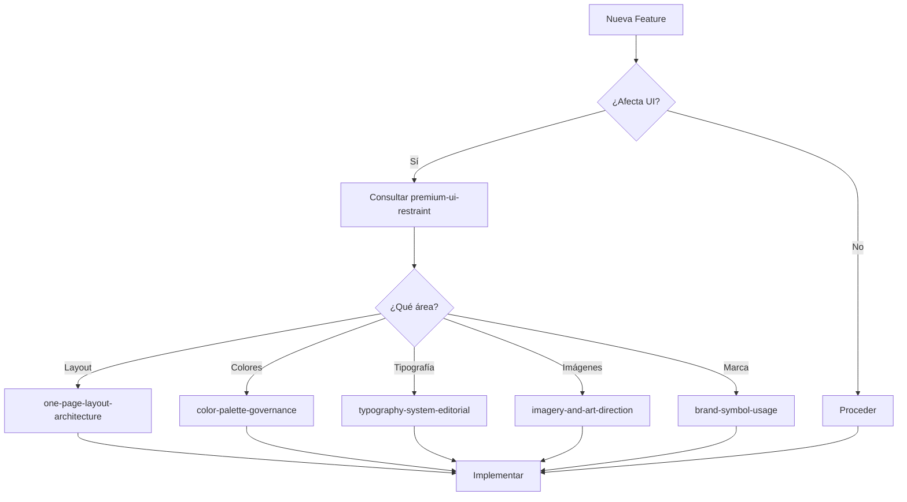

# Soarity Design System - Orchestrator

Este archivo actúa como orquestador central para todos los skills de diseño de Soarity Digital Studio.

## Proyecto

**Soarity Digital Studio** es un estudio digital enfocado en crear experiencias web premium y sofisticadas.

## Skills Disponibles

Cuando trabajes en este proyecto, estos skills están disponibles y deben ser consultados según el contexto:

| Skill | Cuándo Usar | Prioridad |
|-------|-------------|-----------|
| `visual-tone-definition` | Al definir la estética general | 🔴 Alta |
| `premium-ui-restraint` | En CADA decisión de UI | 🔴 Alta |
| `typography-system-editorial` | Al trabajar con texto | 🟡 Media |
| `color-palette-governance` | Al aplicar colores | 🟡 Media |
| `one-page-layout-architecture` | Al estructurar layouts | 🟡 Media |
| `imagery-and-art-direction` | Al trabajar con imágenes | 🟢 Normal |
| `brand-symbol-usage` | Al usar logos/marca | 🟢 Normal |

## Reglas Globales

### Estilo de Código
- React + TypeScript
- CSS Modules o CSS-in-JS
- Componentes funcionales con hooks
- Nombres descriptivos en inglés

### Estándares de Diseño
1. **Mobile First**: Siempre diseñar primero para móvil
2. **Accesibilidad**: WCAG 2.1 AA mínimo
3. **Performance**: Core Web Vitals optimizados
4. **Consistencia**: Usar tokens definidos, no valores hardcodeados

### Jerarquía de Decisiones
1. Restricciones de `premium-ui-restraint` siempre aplican
2. Luego consultar el skill específico del área
3. En caso de conflicto, priorizar UX sobre estética

## Flujo de Trabajo Recomendado



## Tokens Globales

Referencia rápida a los tokens más usados:

```css
/* Spacing */
--space-xs: 0.25rem;    /* 4px */
--space-sm: 0.5rem;     /* 8px */
--space-md: 1rem;       /* 16px */
--space-lg: 1.5rem;     /* 24px */
--space-xl: 2rem;       /* 32px */
--space-2xl: 3rem;      /* 48px */
--space-3xl: 4rem;      /* 64px */

/* Border Radius */
--radius-sm: 4px;
--radius-md: 8px;
--radius-lg: 12px;
--radius-xl: 16px;
--radius-full: 9999px;

/* Transitions */
--transition-fast: 150ms ease;
--transition-base: 200ms ease;
--transition-slow: 300ms ease;
```

## Checklist General

Antes de cualquier commit o deploy:

- [ ] ¿Sigue las restricciones de `premium-ui-restraint`?
- [ ] ¿Usa los tokens de color correctos?
- [ ] ¿La tipografía sigue la escala?
- [ ] ¿Es responsive (mobile-first)?
- [ ] ¿Pasa las pruebas de accesibilidad?
